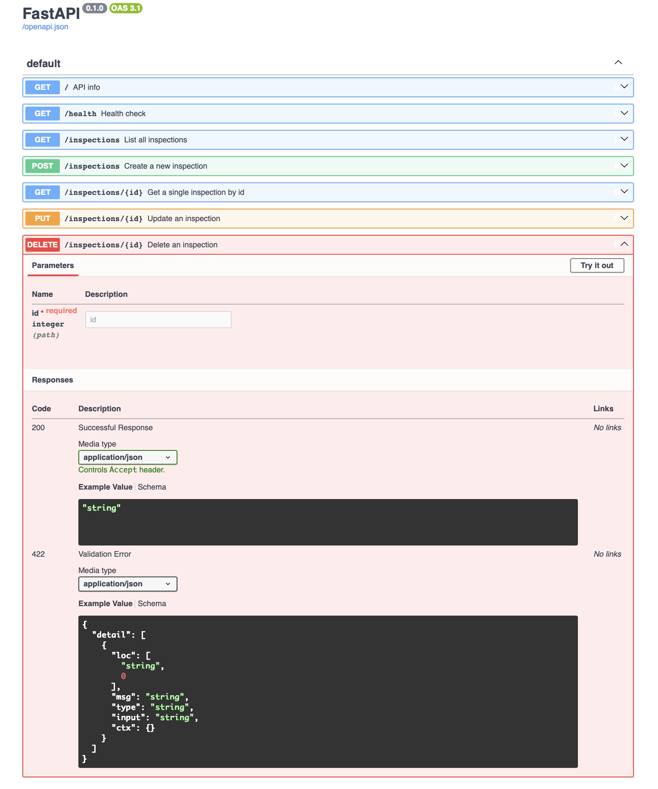

# Site Inspection API

A CRUD API for tracking site visits — each item is an inspection task on a property
(`plot_id`, `issue`, `resolved`). Built with FastAPI for a backend internship
assignment. Data lives in an in-memory list, so it resets on restart.

## Running

```
uv run uvicorn main:app --reload
```

The server starts on http://localhost:8000, with interactive docs at
http://localhost:8000/docs.

## Endpoints

| Method | Path | Description |
|--------|------|-------------|
| GET | `/` | API name, version and endpoint list |
| GET | `/health` | Health check — `{"status": "ok"}` |
| GET | `/inspections` | List all inspections |
| GET | `/inspections/{id}` | One inspection; 404 if the id doesn't exist |
| POST | `/inspections` | Create an inspection (needs `plot_id` and `issue`); returns 201 |
| PUT | `/inspections/{id}` | Update `plot_id`, `issue` and/or `resolved` |
| DELETE | `/inspections/{id}` | Delete an inspection; 204 with empty body |

Server-assigned fields (`id`, `resolved` on create) are never taken from the
client. Invalid input gets a 400 with `{"error": "..."}`.

## Examples

```
curl http://localhost:8000/inspections

curl -X POST http://localhost:8000/inspections \
  -H "Content-Type: application/json" \
  -d '{"plot_id": "P-104", "issue": "Gate hinge rusted"}'

curl -X PUT http://localhost:8000/inspections/4 \
  -H "Content-Type: application/json" \
  -d '{"resolved": true}'
```

## Swagger UI

FastAPI generates interactive docs from the code — every endpoint can be tried
out directly from the browser:


